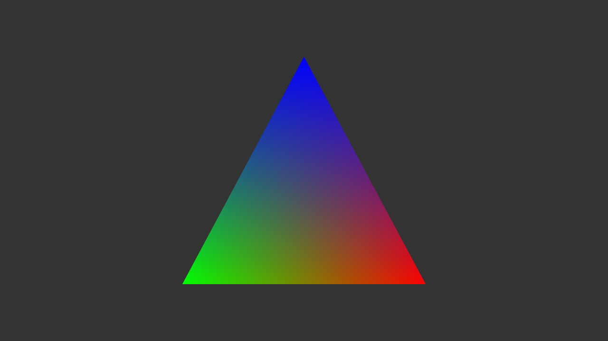

# CrossWindow Demos

[![cmake-img]][cmake-url]
[![License][license-img]][license-url]

A variety of demos showcasing how to use CrossWindow to build cross platform applications.

## Demos

### Cross Platform Cross API Hello Triangle

An example showcasing the rendering of a simple triangle in every supported graphics API and operating system. 

<!--
### UI Windows

How to create UIs that have resizable windows similar to image editors like Photoshop or game engines like Unity or Unreal Engine.
-->

[cmake-img]: https://img.shields.io/badge/cmake-3.6-1f9948.svg?style=flat-square
[cmake-url]: https://cmake.org/
[license-img]: https://img.shields.io/:license-mit-blue.svg?style=flat-square
[license-url]: https://opensource.org/licenses/MIT